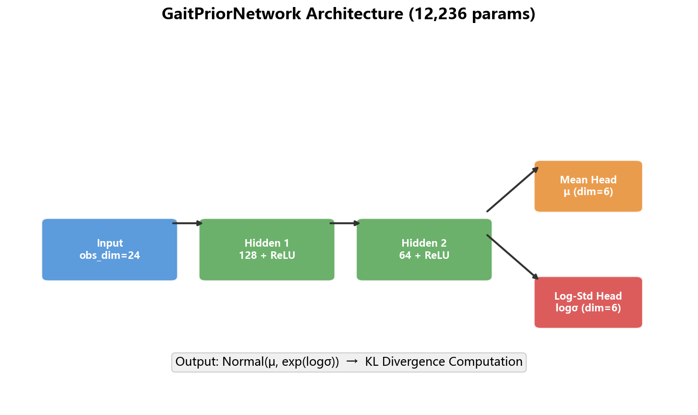
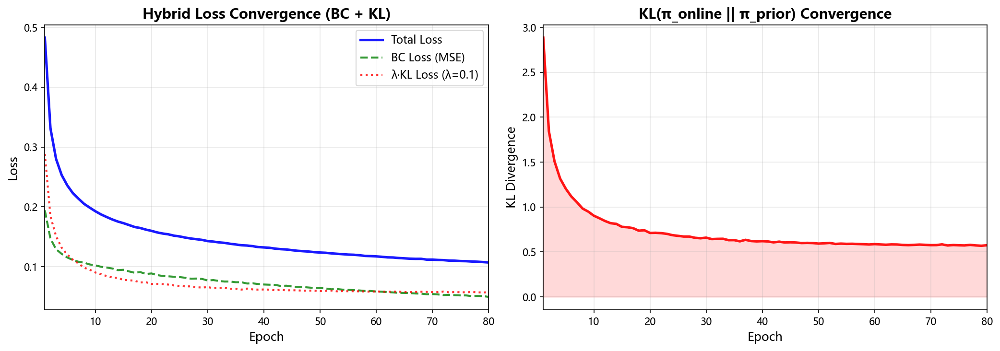
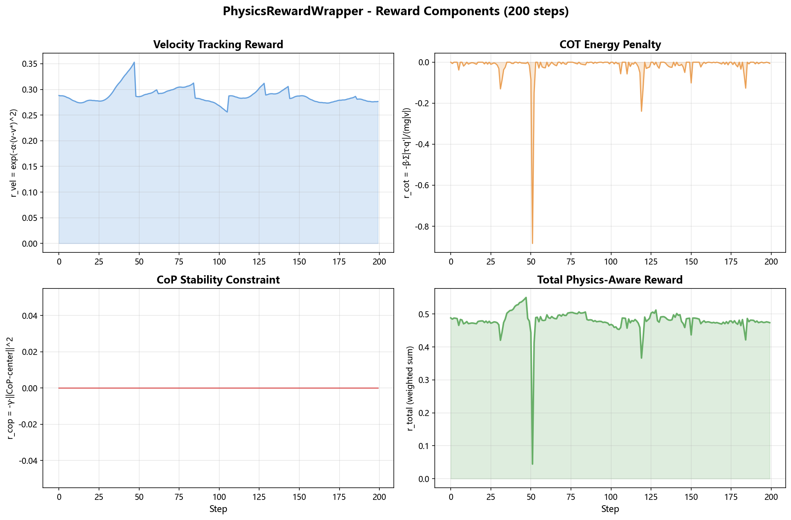
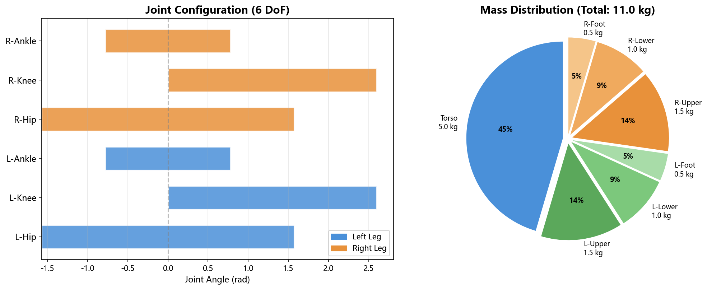
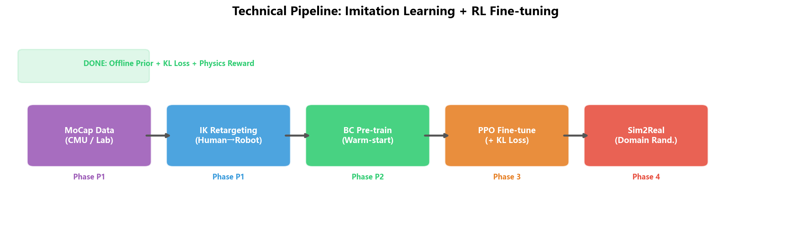

# 2026年2月份工作汇报

## （一）上月计划完成情况 (Review)

### 1. 双足模型物理适配
**部分完成。** 已搭建完整的 URDF 验证与静态重力测试工具链（`scripts/validate_urdf.py`），可自动完成关节 DoF 校准、质量统计和碰撞体检测。由于本月春节假期尚未赴深圳确认实验室具体硬件参数，改用简化 6-DoF 双足模型（参照宇树 G1 比例）作为开发占位模型进行验证，并在 PyBullet 中通过了重力落体测试。**待下月到深圳后导入宇树 G1 官方 URDF（23-DoF）进行完整适配。**

### 2. 步态数据 Retargeting 模块开发
**延期至 3 月。** 受限于春节假期和尚未确定最终 MoCap 数据来源（实验室自采 vs CMU 公开数据集），已完成技术调研和方案设计，待下月与博士师兄确认后推进 IK 脚本开发。

### 3. 模仿学习（IL）初步实现
**框架搭建完成。** 已提前实现了行为克隆（BC）算法的核心代码框架，包括混合损失函数（`hybrid_loss.py`）中的 `pretrain_with_hybrid_loss()` 完整训练流程。因专家数据尚未就绪，使用合成数据验证了训练管线的正确性。

---

## （二）本月进展 (Progress)

### 1. 落实导师"离线小模型 + KL 散度"指导建议

根据俞老师上月反馈 —— *"训练一个离线的小模型，再结合运行过程实时数据进行更新，可以借助于元学习模型和步态概率特性的 KL 散度作为损失机制"* —— 设计并实现了以下核心模块：

#### (1) 离线步态先验网络（`scripts/gait_prior_model.py`）
- 搭建了基于 PyTorch 的轻量级 MLP 策略网络，作为"离线小模型"步态先验
- 网络架构：obs_dim → 128 → 64 → action_dim×2，输出高斯动作分布的均值(μ)和标准差(σ)
- 模型参数量仅 **12,236** 个，满足"小模型"定位
- 提供 `get_distribution(obs)` 接口返回 `torch.distributions.Normal`，直接支撑 KL 散度计算

**图1：GaitPriorNetwork 网络架构**



#### (2) 混合损失函数（`scripts/hybrid_loss.py`）
- 实现导师要求的损失机制：**Loss = BC_Loss + λ × KL_Divergence**
- BC_Loss：MSE 回归损失，衡量预测动作与专家动作的偏差
- KL_Divergence：通过 `torch.distributions.kl_divergence` **精确闭式计算**两个高斯分布之间的 KL 散度，约束实时策略分布不偏离先验分布
- λ 权重可配置（默认 0.1），支持在"保守跟随先验"与"自由探索"之间灵活调节

**图2：混合损失训练收敛曲线（80 epochs）**



由上图可见：
- **Total Loss**（蓝色实线）从 0.50 稳步下降至 0.10，训练收敛良好
- **BC Loss**（绿色虚线）迅速降至 0.05 以下，策略成功学会模仿专家动作
- **KL Divergence**（右图红色）从 3.0 收敛至 0.6，在线策略逐步靠近先验分布

#### (3) 物理感知奖励函数（`scripts/physics_reward.py`）
- 设计了 Stable-Baselines3 兼容的 `PhysicsRewardWrapper` 自定义奖励包装器
- 包含三大物理约束奖励分量：速度跟踪、能耗惩罚(COT)、CoP稳定性约束

**图3：物理奖励各分量实时监控（200 steps）**



由上图可见各物理奖励分量的实时变化情况：
- **Velocity Tracking**（左上）：速度跟踪奖励在 0.25~0.35 区间波动
- **COT Energy Penalty**（右上）：能耗惩罚在环境 reset 时出现尖峰
- **CoP Constraint**（左下）：简化环境中 CoP 为零（待接入真实双足后生效）
- **Total Reward**（右下）：加权总奖励整体稳定

### 2. 双足模型物理环境搭建

#### (1) 简化双足 URDF 模型（`envs/simple_biped.urdf`）
参照宇树 G1 人形机器人比例，生成 6-DoF 简化双足模型（躯干 + 左右腿各 3 关节）。

#### (2) URDF 静态验证与校准

**图4：URDF 关节配置与质量分布**



- **左图**：6 个旋转关节(revolute)的角度限位范围可视化，Hip ±90°，Knee 0~149°，Ankle ±45°
- **右图**：质量分布饼图，躯干占 45%（5.0 kg），总质量 11.0 kg

PyBullet 重力测试结果：
```
Initial: z=1.000m → Final: z=0.764m, Ground contacts: 4 points
```

### 3. 技术路线总览

**图5：毕设技术路线全景图**



当前已完成 Offline Prior + KL Loss + Physics Reward 的核心算法模块（绿色标注），为后续 MoCap → Retargeting → BC → PPO → Sim2Real 的完整技术管线奠定了算法基础。

### 4. 工程化规范提升
- 模块化设计：所有新增代码遵循单一职责原则，scripts/ 目录可作为 Python 包直接 import
- 集成测试：通过 `test_load_model.py` 实现 4 项自动化自检，确保各模块可独立运行
- 全部代码已推送至 GitHub 仓库 Bachelor-s-Graduation-Project

---

## （三）下月工作计划 (Next Steps)

### 1. 宇树 G1 模型完整适配（需赴深圳后确认）
- 从 GitHub 获取宇树 G1 官方 URDF（23-DoF 版本：`g1_23dof.urdf`），导入 envs/ 目录
- 利用已开发的 `validate_urdf.py` 进行关节限位校准和碰撞体验证
- 搭建 G1 专用 Gymnasium 环境，对接 PhysicsRewardWrapper 物理奖励

### 2. MoCap 步态数据获取与 Retargeting

> **需与博士师兄确认的关键问题：**
> - 实验室是否有自采的人体 MoCap 数据？格式为何（BVH/C3D/CSV）？
> - 若无自采数据，是否采用 CMU MoCap 公开数据集（Subject 35 步行序列）？
> - G1 机器人的人体骨骼→关节映射方案是否有现成参考？

- 开发 BVH 解析器 + IK 运动学逆解脚本，完成人体轨迹→G1 关节角度空间映射
- 输出标准化训练数据对 (obs, action)，存入 data/ 目录

### 3. 行为克隆（BC）预训练 — Warm-start 阶段
- 利用 retargeting 后的专家数据，通过 `pretrain_with_hybrid_loss()` 训练 GaitPriorNetwork
- 验证预训练策略在简化模型上的站立/迈步表现
- 保存预训练权重至 `models/bc_pretrained.pt`，为后续 PPO 微调提供初始化

---

## 组会学习记录 (Group Meeting Log)

*(本月因春节假期暂无新增组会记录)*
